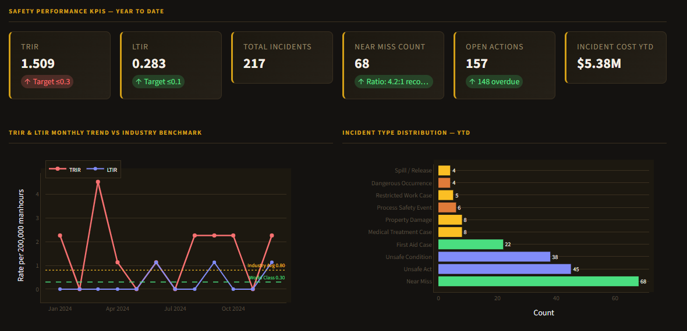

# HSIP Platform

## HSE Incident Prediction & Safety Culture Intelligence

**Predicts Lost Time Injury probability 30 days ahead — Gradient Boosting, Safety Culture Index, deployed on Docker and Streamlit Cloud.**

🔗 **[Live Demo: hsip-platform-ninahenchy.streamlit.app](https://hsip-platform-ninahenchy.streamlit.app/)**


[](https://sqlite.org)


Production-grade safety culture intelligence platform for Oil & Gas production facility operations — predicting LTI probability from leading indicators before incidents occur.

---

## Model Performance

| Metric | Value | Notes |
|---|---|---|
| Model | **Gradient Boosting + Isotonic Calibration** | Calibrated probabilities for operational use |
| Prediction Horizon | **30 days** | Per-department weekly LTI probability |
| Training Data | **2,288 weekly records** | 11 departments × 52 weeks |
| Validation | **Temporal split** | No data leakage — mirrors production deployment |
| Calibration | **Isotonic** | Ensures predicted probabilities reflect true event rates |
| Tests | **19 / 19 passing** | Full automated test suite |

> **Why Isotonic Calibration?** HSIP outputs are presented directly to safety teams as "probability of LTI in the next 30 days." Uncalibrated scores are relative ranks, not true probabilities. After isotonic calibration, a score of 0.68 means approximately 68 in every 100 departments with that profile experienced an LTI within 30 days — a number a safety manager can act on.

---

## Safety Culture Index (SCI)

The SCI is a composite leading indicator score that serves as the primary model input. Weights are evidence-based:

| Leading Indicator | Weight | Rationale |
|---|---|---|
| Near-miss reporting rate | **25%** | Strongest predictor of future LTI — signals reporting culture health |
| Training compliance | **25%** | Competency gaps directly correlate with incident risk |
| Inspection score | **20%** | Physical condition and procedure adherence |
| CAPA close-out rate | **20%** | Whether identified risks are actually being fixed |
| PTW compliance | **10%** | Procedural discipline for high-risk work |

**SCI Interpretation:**

| Score | Classification | Action |
|---|---|---|
| 80–100 | Excellent | Monitor and maintain |
| 65–79 | Good | Review weakest indicator |
| 50–64 | Fair | Targeted intervention required |
| Below 50 | Poor | Immediate management attention |

---

## Dashboard Preview



---

## Platform Overview

| Layer | Capability | Audience |
|---|---|---|
| **Safety Culture Command Centre** | Department SCI scores, fleet-level safety culture health, risk heatmap | HSE Director |
| **Department Analysis** | Department-level SCI breakdown, trend analysis, peer comparison | HSE Manager |
| **LTI Prediction Intelligence** | 30-day LTI probability per department, confidence intervals, risk drivers | Operations Manager |
| **SCI Trend Analysis** | Weekly SCI movement, leading indicator trends, early warning signals | HSE Supervisor |
| **Training & Competency** | Training compliance rates, competency gap analysis, correlation with SCI | Training Manager |
| **Data Entry** | Weekly departmental KPI input — writes directly to database and updates predictions | Data Administrator |

---

## Architecture

```
Data Entry (Streamlit Forms — weekly per department)
        │
        ▼
  SQLite Database
  (ISO 45001 aligned schema · 11 departments · weekly_dept_snapshot table)
        │
        ▼
   ETL Pipeline
   (SCI composite calculation · leading indicator aggregation · historical trending)
        │
        ▼
  Safety Culture Index Engine
  (weighted composite: near-miss 25% · training 25% · inspection 20% · CAPA 20% · PTW 10%)
        │
        ▼
  Gradient Boosting Model + Isotonic Calibration
  (30-day LTI probability per department · calibrated output)
        │
        ▼
  6-Page Streamlit Dashboard
  (command centre · department analysis · LTI prediction · trends · training intel · data entry)
```

---

## Platform Pages

| Page | Content |
|---|---|
| Safety Culture Command Centre | Fleet SCI overview, all-department risk dashboard, critical alerts |
| Department Analysis | Per-department SCI breakdown, indicator performance, peer benchmarking |
| LTI Prediction Intelligence | 30-day LTI probability per department, top risk drivers, trend |
| SCI Trend Analysis | Weekly SCI movement across departments, correlation with historical LTI rates |
| Training & Competency Intel | Training compliance, competency coverage, correlation analysis with SCI |
| Data Entry | Weekly KPI input — observation counts, training records, inspection scores, CAPA status |

---

## Departments Monitored

11 operational departments across the OPC-Alpha simulated offshore facility:

**Operations · Maintenance · HSE · Drilling · Process Engineering · Logistics · Contractor · Management · Electrical · Instrumentation · Quality Assurance**

---

## Standards Alignment

| Standard | Application |
|---|---|
| **ISO 45001** | OH&S management system framework — leading indicator architecture, management of change, corrective action management |
| **ISO 10816** | Vibration severity classification referenced in inspection scoring |
| **API RP 754** | Process safety event context — see also HSEI platform for full PSE analytics |

---

## Tech Stack

```
Python 3.11    Scikit-Learn    Pandas    NumPy
SQLite         SQLAlchemy      Plotly    Streamlit
Docker         Git             pytest
```

---

## Run Locally

```bash
# Clone the repository
git clone https://github.com/NinaHenchy/hsip-platform
cd hsip-platform

# Run with Docker (recommended)
docker-compose up --build
# Open http://localhost:8504

# Or run directly
pip install -r requirements.txt
streamlit run dashboards/app.py
```

The platform initialises its own database, runs ETL, and trains the prediction model automatically on first launch. No manual setup required.

---

## Project Structure

```
hsip-platform/
├── dashboards/
│   ├── app.py                    # Main Streamlit application
│   ├── components/               # Reusable UI components and teal slate theme
│   └── pages/                    # p1_command_centre.py · p2_to_p5.py · p_data_entry.py
├── database/
│   ├── schemas/                  # ISO 45001 aligned SQL schema
│   └── db_connection.py          # Database connection management
├── etl/
│   ├── extractors/               # Synthetic safety culture data generation
│   └── loaders/                  # Database loading pipeline
├── models/
│   ├── predictor.py              # Gradient Boosting training and inference
│   └── artifacts/                # Serialised model files (.pkl)
├── tests/                        # 19 automated tests
├── scripts/                      # Setup and training scripts
├── requirements.txt
└── docker-compose.yml
```

---

## Live Demo

🔗 **[hsip-platform-ninahenchy.streamlit.app](https://hsip-platform-ninahenchy.streamlit.app/)**

The platform initialises its database, runs ETL, and trains the prediction model automatically on first load. Allow up to 90 seconds on first visit.

---

## Related Platforms — OPC-Alpha Analytics Suite

All three platforms run on the same simulated offshore production facility (OPC-Alpha) and share a consistent data architecture.

| Platform | Focus | Standards | Tests | Live Demo |
|---|---|---|---|---|
| **[ORPMI](https://github.com/NinaHenchy/orpmi-platform)** | Operational Reliability & Predictive Maintenance Intelligence | ISO 14224 · ISO 10816 | 76 ✅ | [Launch](https://orpmi-platform-ninahenchy.streamlit.app/) |
| **[HSEI](https://github.com/NinaHenchy/hsei-platform)** | HSE Incident Analytics & Process Safety Intelligence | API RP 754 · ISO 45001 · NUPRC · NOSDRA | 29 ✅ | [Launch](https://hsei-platform-ninahenchy.streamlit.app/) |

---

## Author

**Nnenna Henchard** — Reliability Data Scientist · 15 years O&G Operations & HSE

[](https://linkedin.com/in/nnenna-henchard)
[](https://ninahenchy.github.io)
[](mailto:ninahenchard@gmail.com)
